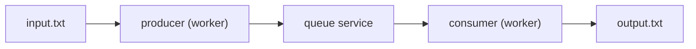

# kkv-code-test

A simple file-to-file messaging pipeline using Go's standard library. It reads lines from a file (or many files in watch mode), sends lines through an HTTP queue service, and writes them to output files verifying content reproduction.


## Components

- **queue-service**: In-memory FIFO queue with HTTP API (stdlib only)
- **worker**: Single process that (1) reads an input file -> enqueues lines, (2) dequeues lines -> writes an output file; or runs in stream mode (tail) or directory watch mode (multi-file once processing)


### Flow Diagram


## Quick Start (Watch Mode Focus)

Watch mode processes every complete file dropped into a directory. This is now the default compose configuration.

### Docker (Recommended)
```bash
mkdir -p data/in data/out
docker compose up --build
```
Drop files into `data/in`:
```bash
echo "hello" > data/in/1.txt
echo "second" > data/in/2.txt
```
Outputs will appear (after size stability) in `data/out/1.txt` and `data/out/2.txt`.

### Local (without Docker)
In one terminal start the queue:
```bash
go run ./cmd/queue-service
```
In another run worker watch mode:
```bash
go run ./cmd/worker -watch-dir data/in -watch-out data/out -queue lines
```
Then drop files into `data/in` as above.

### Optional: Single-File Modes
Once mode (one-shot copy):
```bash
go run ./cmd/queue-service &
go run ./cmd/worker -mode once -in data/input.txt -out data/output.txt
```
Stream (tail) mode (append lines while running):
```bash
go run ./cmd/queue-service &
go run ./cmd/worker -mode stream -in data/input.txt -out data/output.txt &
echo "another line" >> data/input.txt
```

## Testing & Quality
Basic test run:
```bash
go test ./...
```

With race detector:
```bash
go test -race ./...
```

Coverage summary:
```bash
go test -cover ./...
```

Coverage profile & HTML report:
```bash
go test -coverprofile=coverage.out ./...
go tool cover -html=coverage.out -o coverage.html
```

The suite includes:
- Unit tests for queue (`internal/queue`), API server (`internal/api`), and client (`internal/rwclient`)
- An end-to-end integration test at `internal/integration/worker_e2e_test.go` verifying byte-for-byte reproduction of the input

Exit codes:
- Worker exits 0 on successful copy (or continuous run in `stream` until interrupted)
- Worker exits 1 if producer or consumer returns a non-cancellation error

## Configuration

### queue-service flags:
- `-addr` - Server address (default: `:8080`)

### worker flags (single-file modes):
- `-queue-url` - Queue service URL (default: `http://localhost:8080`)
- `-queue` - Queue name (default: `lines`)
- `-in` - Input file path (default: `data/input.txt`)
- `-out` - Output file path (default: `data/output.txt`)
- `-mode` - `once` (default) copies file then exits; `stream` tails the input file for appended lines (newline-delimited) and continuously consumes until interrupted

Stream (tail) mode example (append to input file while it runs):
```bash
go run ./cmd/worker -mode stream -in data/input.txt -out data/output.txt &
echo "new line" >> data/input.txt
```

### Directory watch mode (multi-file batch ingestion)

Process every regular file dropped into a directory exactly once (after it becomes size-stable across two polls). Each file uses an isolated queue name derived from its filename (`<base>-<sanitized-name>`) and is written to an output directory using the same basename.

Flags specific to watch mode:
- `-watch-dir` - Enable watch mode for this directory (disables `-in/-out/-mode`)
- `-watch-out` - Output directory for processed files (default: `data/out`)
- `-watch-interval` - Poll interval (default: 500ms)
- `-queue` - Base queue name; per-file queues become `<base>-<sanitized-filename>`

Local example:
```bash
mkdir -p data/in data/out
echo "alpha" > data/in/a.txt
echo "beta" > data/in/b.txt
go run ./cmd/worker -watch-dir data/in -watch-out data/out -queue lines
```
After stability detection you'll get:
```
data/out/a.txt
data/out/b.txt
```
Dropping additional files later processes them too. Existing processed files are skipped; partial writes are avoided by waiting for file size to stop changing (stability = unchanged size for one poll interval). Processing happens concurrently: multiple stable files can be copied in parallel.

Mode distinctions:
- once: one-shot copy then exit
- stream: continuous tail of a single file for appended lines (newline framed)
- watch-dir: batch process many files once each when complete (per-file queue; isolated to prevent cross-file ordering concerns)


## Design Choices

### Architecture
Two processes:
- `queue-service` provides HTTP queue operations (POST enqueue, DELETE dequeue, HEAD length)
- `worker` runs two goroutines (producer + consumer) joined by the queue

Design notes:
- Standard library only in queue service per requirement
- Output file is a byte-for-byte copy (including final line handling) of input
- Separation allows scaling queue independently of workers

### Queue Implementation
- **In-memory FIFO**: Simple `[][]byte` slice with mutex protection
- **Message preservation**: Stores raw bytes including newlines to maintain file format

### HTTP API
- `POST /queues/{name}` - Enqueue message (raw bytes)
- `DELETE /queues/{name}` - Dequeue message (200 + body or 204 if empty)
- `HEAD /queues/{name}` - Returns `X-Queue-Len`

### Concurrency Model
- Producer goroutine reads file once and enqueues lines
- Consumer goroutine polls queue and writes to output
- In `once` mode: exits after producer done and queue drained
- Context cancellation on signal for graceful termination


## Current limitations

Single in-memory queue service (messages lost on restart); no batching, retries, limits, or metrics. Watch mode uses polling (not FS events) and treats a file as complete once size is stable for one additional poll (may not catch very slow writers—tune `-watch-interval`). Stream mode buffers a partial trailing line until newline appended. No back-pressure or max queue size enforcement.


## Future improvements

- Add persistence (e.g. redis or another db)
- Horizontal scaling
- Batching to reduce HTTP round trips
- Add guardrails (e.g. cap queue size + rejection when full)
- Separate queue for repeatedly failing messages
- Add Basic metrics (queue length, enqueue/dequeue counts, errors)
- Add Structured contextual logging for observability
- Wrap errors
- Add Tracing
- Use layered architecture
- Use modern router framework (e.g. echo)
- Component tests
