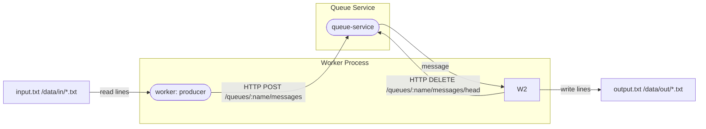
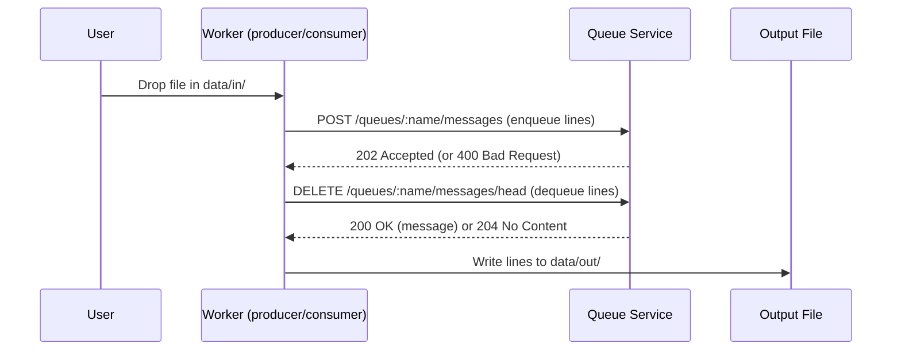
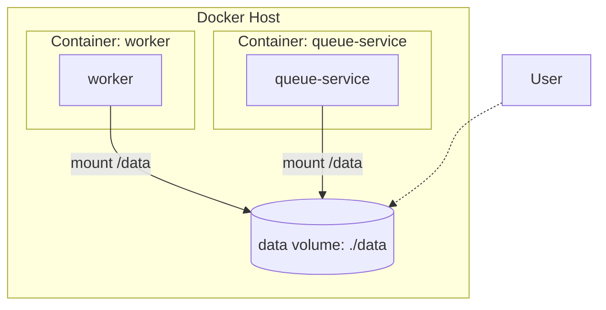

# Assignment: Queue between a file reader and writer

It’s your job to design a simple messaging system by using a queue service:

- Read lines from a file
- Write lines to a queue service via a network protocol
- Read lines from the queue service via a network protocol
- Write lines to a file

Implement it as 2 asynchronous workers exchanging information by using a service.


## Task requirements

- Documentation on how to run your solution
- Queuing service needs to be written with only stdlib of your language of choice
- An arbitrary ASCII text file fed into the solution should produce an identical copy

### Bonus Tasks
- Use only one process for the reader/writer and one for the queue service
- Your solution has full unit test coverage
- You have a service/container-based deployment strategy
- Documentation of design choices and alternatives
- Scaling strategy

---

# Solution Overview

File-to-file messaging pipeline using Go's standard library. Reads lines from a file (or directory in watch mode), sends them through an HTTP queue service, and writes them to output files, verifying content reproduction. Only two processes are used: one for the queue service and one for the worker (reader/writer).

## Components

- **queue-service**: In-memory FIFO queue with HTTP API (stdlib only). Endpoints:
	- `POST /queues/:name/messages` (enqueue, accepts `application/octet-stream` or JSON `{ "message": "..." }`)
	- `DELETE /queues/:name/messages/head` (dequeue, returns message as `application/octet-stream`)
- **worker**: Single process that acts as both reader (producer) and writer (consumer). Supports single-file, stream, and directory watch modes. Communicates with the queue-service using the above endpoints.

---

## Diagrams

### Architecture Diagram



### Sequence Diagram



### Deployment Diagram



### 1. Build and start all services:
```bash
docker-compose up --build
```

This will start both the queue service and the worker, mounting the local `./data` directory into the containers.

### 2. Using the pipeline:
- Create input/output directories if they don't exist:
	```bash
	mkdir -p data/in data/out
	```
- Drop a file into `data/in/` (for example):
	```bash
	echo "hello world" > data/in/example.txt

	# Or create a more complex file with line breaks:
    
    ```  
cat > data/in/complex.txt <<EOF      
first line        
second line        
third line        

last line        
EOF 
```
- The worker will process them and write outputs to `data/out/` (mirroring filenames):
	```bash
	cat data/out/example.txt
	# Output: hello world
	```

### 3. Stopping services:
```bash
docker-compose down
```

---

## Quick Start (Local, without Docker)


### 1. Start the queue service (terminal 1):
```bash
go run ./cmd/queue-service
```

### 2. Start the worker (terminal 2):

#### Directory watch mode:
```bash
mkdir -p data/in data/out
go run ./cmd/worker -watch-dir data/in -watch-out data/out -queue lines
```
Drop files into `data/in/` and outputs will appear in `data/out/` with the same filenames.

#### Single-file once mode:
```bash
go run ./cmd/worker -mode once -in data/input.txt -out data/output.txt -queue lines
```

#### Stream (tail) mode:
```bash
go run ./cmd/worker -mode stream -in data/in/input.txt -out data/out/output.txt -queue lines
echo "another line" >> data/in/input.txt
```

- Make sure the queue service is running before starting the worker.
- The default queue URL is `http://localhost:8080` (use `-queue-url` if you change it).
- The `-queue` flag must match between producer and consumer.

#### Example: Creating a complex input file
```bash
cat > data/in/complex.txt <<EOF
first line
second line
third line

last line
EOF
```


## Testing

Run all tests:
```bash
go test ./...
```
With race detector:
```bash
go test -race ./...
```
Coverage:
```bash
go test -cover ./...
```
HTML report:
```bash
go test -coverprofile=coverage.out ./...
go tool cover -html=coverage.out -o coverage.html
```


## Configuration

### queue-service flags:
- `-addr` - Server address (default: `:8080`)

### worker flags:
- `-queue-url` - Queue service URL (default: `http://localhost:8080`)
- `-queue` - Queue name (default: `lines`)
- `-in` - Input file path (default: `data/input.txt`)
- `-out` - Output file path (default: `data/output.txt`)
- `-mode` - `once` (default) or `stream` (tail mode)
- `-watch-dir` - Directory to watch for new files (disables `-in/-out/-mode`)
- `-watch-out` - Output directory for processed files (default: `data/out`)
- `-watch-interval` - Poll interval (default: 500ms)


## Design

- Only two processes: one for the queue service, one for the worker (reader/writer)
- Standard library only in queue service
- Output file is a byte-for-byte copy of input
- In-memory FIFO queue with mutex protection
- HTTP API:
	- `POST /queues/:name/messages` (enqueue, accepts `application/octet-stream` or JSON `{ "message": "..." }`)
	- `DELETE /queues/:name/messages/head` (dequeue, returns message as `application/octet-stream`, 204 if empty)
## API Reference

### Enqueue (POST /queues/:name/messages)

- **Content-Type:** `application/octet-stream` (raw bytes) or `application/json` (`{"message": "..."}`)
- **Response:**
	- `202 Accepted` on success
	- `400 Bad Request` for missing/invalid input

### Dequeue (DELETE /queues/:name/messages/head)

- **Response:**
	- `200 OK` with message as `application/octet-stream` if a message is available
	- `204 No Content` if the queue is empty
	- `400 Bad Request` for missing/invalid queue name
- Worker uses goroutines for producer/consumer logic


## Limitations

- Single in-memory queue service (messages lost on restart)
- No batching, retries, limits, or metrics
- Watch mode uses polling (not FS events)
- Stream mode buffers a partial trailing line until newline appended
- No back-pressure or max queue size enforcement
