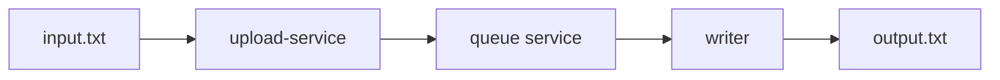

# kkv-code-test

A simple file-to-file messaging pipeline using Go's standard library. Reads lines from a file, sends them through an HTTP queue service, and writes them to an output file.


## Components

- **queue-service**: In-memory FIFO queue with HTTP API
- **upload-service**: HTTP service for uploading a text file and forwarding its lines to the queue

### Flow Diagram


## Quick Start

### Local Development
1. Start the queue service:
```bash
go run ./cmd/queue-service
```

2. Start the upload service and POST a file:
```bash
go run ./cmd/upload-service -addr :8081
curl -F "file=@input.txt" http://localhost:8081/upload
```

### Using Docker
1. Create input file:
```bash
echo "Hello World" > input.txt
```

2. Run with Docker Compose:
```bash
docker compose up --build
```

3. Upload file:
```bash
curl -F "file=@input.txt" http://localhost:8081/upload
```

3. Check output:
```bash
cat data/output.txt  # Should show "Hello World"
```

## Testing
```bash
go test ./...
```

## Configuration

### queue-service flags:
- `-addr` - Server address (default: `:8080`)

### upload-service flags:
- `-addr` - Port of upload service (default: `:8081`)
- `-in` - Input file path (default: `input.txt`)
- `-out` - Output file path (default: `output.txt`)  
- `-queue-url` - Queue service URL (default: `http://localhost:8080`)
- `-queue` - Queue name (default: `lines`)


## Design Choices

### Architecture
The system is designed as two separate processes communicating via HTTP:
- **Separation of concerns**: Queue service handles message storage/retrieval, upload-service handles file I/O
- **Standard library only**: Uses Go's `net/http` for simplicity and minimal dependencies
- **Stateless protocol**: HTTP REST API makes the system easy to understand and debug

### Queue Implementation
- **In-memory FIFO**: Simple `[][]byte` slice with mutex protection
- **Message preservation**: Stores raw bytes including newlines to maintain file format

### HTTP API Design
- `POST /queues/{name}` - Enqueue message (body contains raw message bytes)
- `DELETE /queues/{name}` - Dequeue message (returns 200 with body or 204 if empty)
- `HEAD /queues/{name}` - Check queue length via `X-Queue-Len` header
- `POST /upload` - Upload file and enqueue its lines

### Concurrency Model
- **Producer-Consumer pattern**: Reader and writer run as separate goroutines
- **Context cancellation**: Graceful shutdown when producer finishes reading file
- **Non-blocking operations**: HTTP timeouts prevent indefinite blocking


## Current limitations

Single in-memory process; messages are lost on restart; no batching, retries, limits, or metrics.


## Future improvements

- Add persistence (e.g. redis or another db)
- Horizontal scaling
- Batching to reduce HTTP round trips
- Add guardrails(e.g. cax queue size + rejection when full)
- Separate queue for repeatedly failing messages
- Add Basic metrics (queue length, enqueue/dequeue counts, errors)
- Add Structured contextual logging for observability
- Wrap errors
- Add Tracing
- Use layered architecture
- Use modern router framework (e.g. echo)
- Component tests
